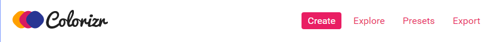
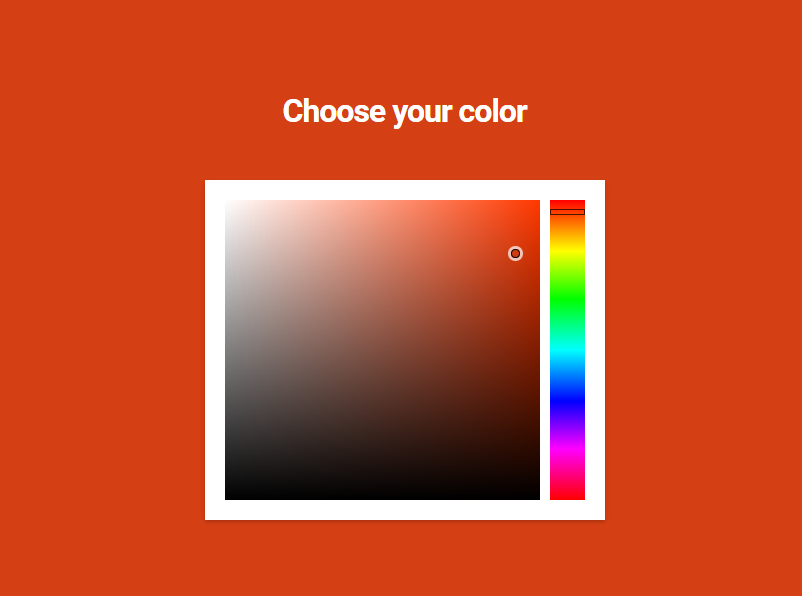
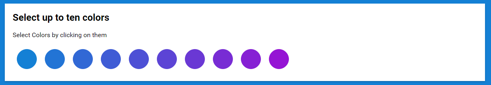
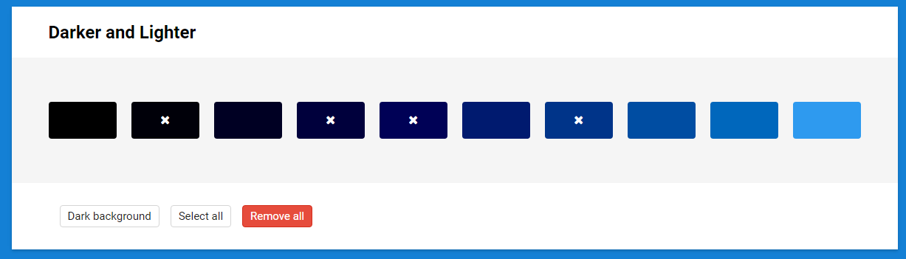
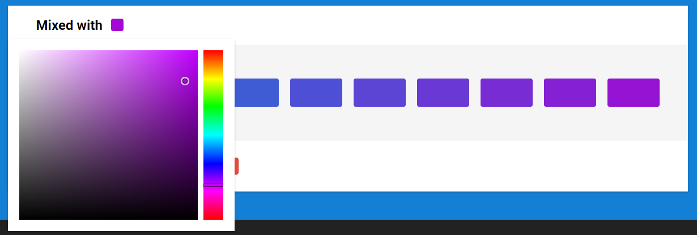
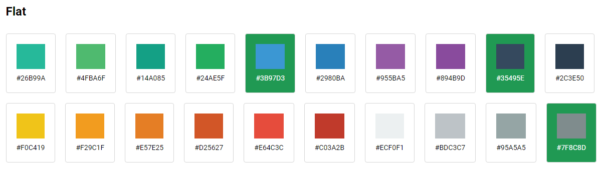
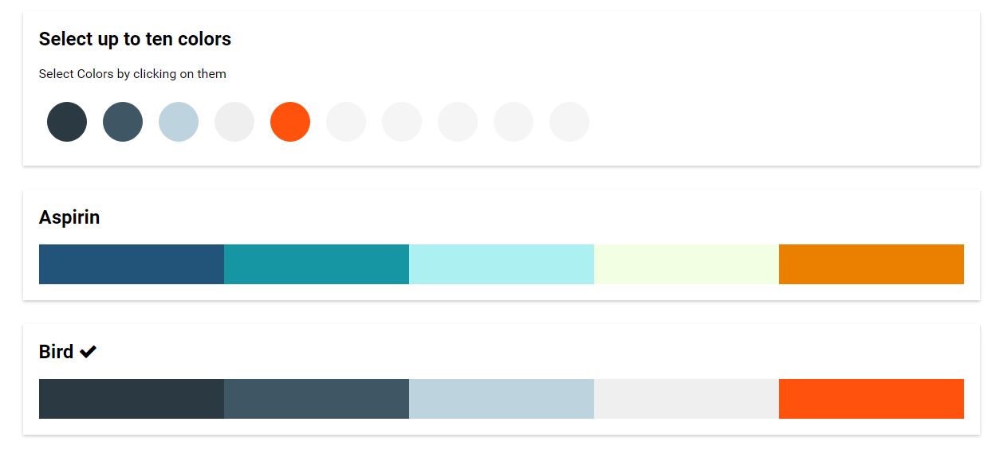
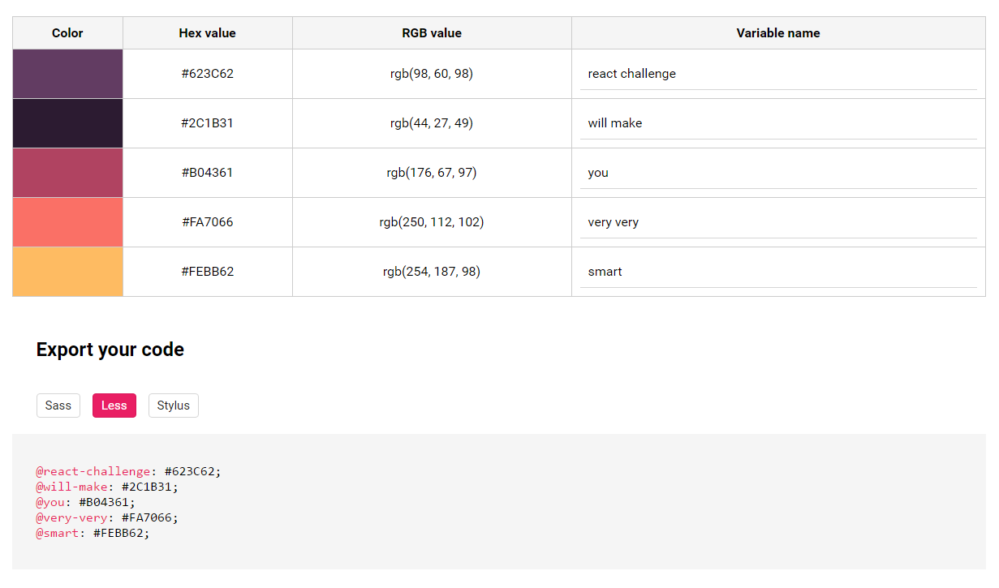

# Задание второго выпуска React Challenge
Во втором выпуске [React Challenge](https://github.com/rtivital/react-challenge-colorizr) вам предлагается построить приложение для работы с цветом. Демо готового приложения можно посмотреть [здесь](http://rtivital.github.io/react-challenge-colorizr/).

## Стартовый шаблон
Для участия в челендже вы можете воспользоваться готовым стартовым [шаблоном](https://github.com/rtivital/react-challenge-colorizr) или использовать свой. Стартовый шаблон предусматривает всё, что может вам понадобиться в ходе выполнения задания: полностью настроено компилирование JavaScript и Sass кода, hot reload, а также генерация данных, которые понадобятся приложению. Инструкции по использованию стартового шаблона вы найдёте в [Readme](./README.md) файле данного репозитория.

## Зависимости
Предполагается, что при работе над проектом вы будете использовать [React](https://github.com/facebook/react), [Redux](https://github.com/reactjs/redux) и [React Router](https://github.com/reactjs/react-router), поэтому в качестве зависимостей у проекта установлены следующие библиотеки:

* [React](https://github.com/facebook/react)
* [Redux](https://github.com/reactjs/redux)
* [React Router](https://github.com/reactjs/react-router)
* [react-redux](https://github.com/reactjs/react-redux)
* [react-router-redux](https://github.com/reactjs/react-router-redux)
* [Immutable.js](https://github.com/facebook/immutable-js/)

## Приложение
Приложение Colorizr разделено на четыре части. Все части связаны между единым набором данных. Для каждой части приложения выделяется отдельный адрес с помощью React Router.

### Навигация
Для реализации навигации используется React Router. Всего в навигации есть четыре ссылки, каждая из которых соответствует отдельной части приложения: Create, Explore, Presets и Export. Ссылка текущей страницы выделяется.



### Страница create
Первая часть приложения работает с введённым пользователем цветом. Ввод цвета осуществляется с помощью колорпикера. В своём решении я использовал [готовый компонент](https://github.com/zippyui/react-color-picker) для его реализации.



Введённый пользователем цвет отражается в виде фона всей страницы Create. Обратите внимание на то, что заголовок меняет свой цвет в зависимости от яркости введённого цвета.

Предполагается, что при использовании приложения можно выбрать от одного до десяти разных цветов. Все выбранные цвета отображаются в отведённом для этого компоненте.



При клике на цвет он удаляется из списка выбранных цветов.

На странице Create есть два компонента, с помощью которых можно добавить цвет к числу выбранных. Оба компонента всегда содержат десять разных цветов.

Первый компонент представляет цвета различной степени яркости. Всё, что в нём находится полностью зависит от текущего выбранного цвета. Каждый цвет, представленный в компоненте отражает ту или иную степень затемнения/осветления выбранного цвета. **Важно**: компонент не должен содержать несколько одинаковых цветов. Если цвет тёмный, то стоит отобразить больше светлых оттенков, если светлый, то, наоборот, больше тёмных. При клике по цвету происходит его добавление к выбранным цветам в том случае, если этот цвет не был выбран ранее. Если цвет уже выбран, то при клике по нему, произойдёт его удаление. Цвета, находящиеся в коллекции, помечаются иконкой или любым другим образом.



С помощью первой кнопки ("Dark background") можно поменять цвет фона, чтобы можно было лучше рассмотреть тёмные или светлые оттенки. Текст кнопки меняется в зависимости от выбранного типа фона. Вторая кнопка ("Select All") позволяет добавить каждый цвет из компонента к выбранным цветам. Третья кнопка ("Remove All") отображается только в том случае, если выбран хотя бы один цвет из текущей коллекции. При клике по ней каждый цвет из коллекции удаляется из выбранных цветов. Обратите внимание, что удаление происходит только тех цветов, которые в данный момент есть в коллекции, другие цвета не удаляются из выбранных.



Второй компонент для выбора цветов смешивает введённый ранее цвет другим, который также можно выбрать с помощью колорпикера. Цвета смешиваются в нарастающих соотношениях. Сначала первый цвет составляет 100%, второй 0%, потом первый 90%, второй 10%, и т.д., пока не наберётся 10 цветов.

### Страницы Explore и Presets
Страницы Explore и Presets во многом похожи друг на друга. На страницах предлагается выбрать заранее заготовленные цветовые наборы.

На странице Explore цвета никак не связаны друг с другом, поэтому их можно выбирать по одному. Каждый выбранный цвет отмечается любым образом (как вам покажется более интересным).



Страница Presets работает с готовыми пресетами (цветовыми схемами). В каждой цветовой схеме содержится ровно пять разных цветов. Цвета из одной схемы создают приятное сочетание. При клике по схеме все выбранные ранее цвета удаляются и добавляются те пять, которые находились в схеме.



Выбранная схема отмечается галочкой (или любым другим способом, какой вам понравится). Схема считается выбранной только в том случае если каждый цвет из схемы присутствует в наборе выбранных цветов. То есть если вы выбрали схему и удалили один цвет, то схема уже не будет считаться выбранной.

Данные для работы страниц Explore и Presets находятся в JSON файле (называется colors.json, находится в папке public, генерируется автоматически). Файл выглядит следующим образом:

```js
{
  // данные для страницы Explore
  "presets": {
    "flat": ['#fff', '#f5f5f5', /* ... */],
    "material": ['#fff', '#f5f5f5', /* ... */],
  },

  // данные для страницы Presets
  "schemes": {
    "aspirin": ["#000", "777", /* ... */],
    "bird": ["#876", "#444", /* ... */],
  }
}
```

Вы можете добавить неограниченное количество своих пресетов и схем. Как это сделать, описано в руководстве к бойлерплэйту.

### Страница Export
Мы хорошо поработали над нашей цветовой палитрой, настало время всё экспортировать. Приложение предусматривает экспорт цветов в виде переменных для препроцессоров Sass, Less и Stylus.



Страница состоит из двух частей: таблицы, в которой можно посмотреть HEX и RGB значения для каждого цвета, а также изменить названия переменных. Вторая часть отображает валидный код для выбранного препроцессора.
