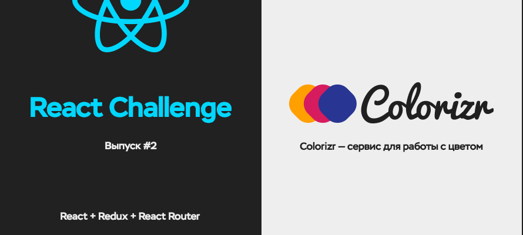

# Второй выпуск React Challenge



## Содержание
* [Про React Challenge](#Про-react-challenge)
  * [F.A.Q. по организации челенджа](#faq-по-организации-челенджа)
    * [Как мне попасть в ваш чат в Slack?](#Как-мне-попасть-в-ваш-чат-в-slack)
    * [Я узнал про челендж слишком поздно и не успеваю его выполнить. Будут ли материалы доступны потом?](#Я-узнал-про-челендж-слишком-поздно-и-не-успеваю-его-выполнить-Будут-ли-материалы-доступны-потом)
    * [Я не хочу использовать React, но хочу выполнить задание.](#Я-не-хочу-использовать-react-но-хочу-выполнить-задание)
    * [Я выполнил задание без использования React. Вам это интересно?](#Я-выполнил-задание-без-использования-react-Вам-это-интересно)
    * [Вы оцениваете результат выполнения задания?](#Вы-оцениваете-результат-выполнения-задания)
    * [Это бесплатно?](#Это-бесплатно)
* [Стартовый шаблон](#Стартовый-шаблон)
  * [Установка стартового шаблона](#Установка-стартового-шаблона)
  * [Организации работы с бойлерплэйтом](#Организации-работы-с-бойлерплэйтом)
    * [Сборка проекта](#Сборка-проекта)
    * [Автоматическая перезагрузка](#Автоматическая-перезагрузка)
    * [Сборка стилей (Sass)](#Сборка-стилей)
      * [Less и Stylus](#less-и-stylus)
      * [Работа со стилями на простом примере](#Работа-со-стилями-на-простом-примере)
    * [Линтинг](#Линтинг)
    * [Публикация проекта](#Публикация-проекта)
    * [Генерация пресетов](#Генерация-пресетов)

## Про React Challenge
Учить новую технологию всегда непросто. Ещё сложнее сделать это одному, когда нет возможности спросить совета у более опытных разработчиков или своих “товарищей по несчастью”. React Challenge призван объединить всех желающих научиться использовать React и помочь освоить библиотеку.

Работает подобный подход следующим образом. Вы получаете задание (некое подобие ТЗ), стартовый шаблон и демо готового приложения (без исходного кода). Стартовый шаблон включает в себя все файлы (изображения, данные, настройки), которые могут понадобиться вам при выполнении задания. Таким образом, вам не нужно думать о том, как настроить Webpack, вырезать изображения или сгенерировать данные для приложения — всё это уже предусмотрено начальным набором файлов (бойлерплэйтом).

Задание сопровождается подборкой обучающих материалов для изучения React и сопутствующих технологий. Материалы подбираются таким образом, чтобы любой, кто хоть немного ознакомлен с JavaScript смог принять участие. В зависимости от ваших изначальных знаний и навыков, вам может понадобиться больше или, наоборот, меньше времени на изучение материалов. Разумеется, вы не сможете выполнить задание, если вы совсем не знакомы с JavaScript, но, даже если у вас есть минимальный набор знаний, то с помощью обозначенных в челендже статей, видео и интерактивных примеров вы сможете быстро закрыть свои пробелы в JavaScript и приступить к изучению React.

На выполнение задания вам даётся определённое количество времени, чаще всего, три-четыре недели с момента официального запуска челенджа в зависимости от сложности приложения, которое требуется реализовать. По истечению времени подводятся результаты и решение обсуждается участниками. Также на [сайте](http://jsraccoon.ru) выходит статья, где [я](https://github.com/rtivital) рассказываю подробно про своё решение. Если в ходе решения задания у вас возникают какие-либо трудности, то вы можете обратиться за помощью к другим разработчикам в [наш чат на Slack](https://jsraccoon.slack.com) и вам обязательно помогут (о том, как присоединиться к чату, расскажу в отдельном разделе).

В результате участия в челендже вы получите готовое приложение на React, которое не стыдно положить в своё портфолио. Приложение будет размещено на Github Pages, так что вы сможете показать всем, какой функционал реализовали.

[Наверх к содержанию](#Содержание)

### F.A.Q. по организации челенджа
В этом разделе я отвечу на организационные вопросы, которые возникали у многих людей при выполнении первого челенджа.

##### Как мне попасть в ваш чат в Slack?

Чтобы попасть в наш чат вам необходимо оставить свою почту в виде предложенной новости в [группе Вконтакте](http://vk.com/jsraccoon). На обозначенную вами почту будет выслано приглашение. Если вы уже присылали свою почту, но приглашения не получили, то свяжитесь со [мной Вконтакте](http://vk.com/rtivital) и я решу данную проблему.

##### Я узнал про челендж слишком поздно и не успеваю его выполнить. Будут ли материалы доступны потом?

Стартовый шаблон для выполнения челенджа навсегда останется в подобном виде, вы сможете выполнить его в любое время, когда будете к этому готовы. Если вы приступите к выполнению челенджа после его завершения, то у вас будут ещё и подробные инструкции по его выполнению и мы также постараемся вам помочь при возникновении вопросов в нашем чате. Тем не менее, при наличии готового решения у вас часто будет соблазн списать и эффект выполнения челенджа будет уже не таким, каким он задумывался.

##### Я не хочу использовать React, но хочу выполнить задание.

Я не могу вас заставить использовать React — это дело добровольное. Если вам понравилось задание, и вы хотите опробовать свои силы с другой библиотекой, фреймворком или просто с нативным JavaScript, то, разумеется, никто не будет вас останавливать. Вы точно так же сможете поделиться своим решением с другими в чате и найти себе единомышленников. Тем не менее, бойлерплэйт и все прочие материалы будут заточены под React, так что вам самим придётся настраивать своё окружение.

##### Я выполнил задание без использования React. Вам это интересно?

Да, нам это интересно. Обязательно поделитесь своим решением. Если вы хотите подробно рассказать про своё решение, и почему вы выбрали именно такую технологию, то вы сможете это сделать на [сайте Frontend Raccoon](http://jsraccoon.ru), либо на любом другом ресурсе, и я обязательно расскажу про вашу статью в [группе Вконтакте](http://vk.com/jsraccoon) и [твиттере](https://twitter.com/frontendraccoon). Чтобы я как-то узнал про ваше решение вы можете написать либо в общий чат в [Slack](https://jsraccoon.slack.com), либо лично мне [Вконтакте](http://vk.com/rtivital) или на почту, указанную в [моём профиле на Github](https://github.com/rtivital)

##### Вы оцениваете результат выполнения задания?

Нет, официально оценивать ваш код я не буду. Вы не сможете выиграть какие-либо призы за участие в челендже. Всё, что вы получите — знания и опыт. Если у вас есть желание получить оценку ваших стараний, то вы можете попросить других участников челенджа в чате посмотреть ваш код и объяснить, где вы сделали хорошо, а где плохо.

##### Это бесплатно?

Да, всё бесплатно. Предполагается, что вся работа будет проходить на Github. Весь ваш кодбудет размещаться в репозитории, сайт бесплатно размещаться на Github Pages.

[Наверх к содержанию](#Содержание)


## Стартовый шаблон
В этой секции я расскажу о том, как установить бойлерплэйт и о всех его возможностях. Для работы вам потребуется аккаунт на Github, установленные [Git](https://git-scm.com/) и [Node.js](https://nodejs.org/en/).

### Установка стартового шаблона
1. Форкните данный репозиторий
2. Клонируйте свой форк с помощью команды `git clone https://github.com/<account>/react-challenge-colorizr`, вместо `<account>` подставьте имя своего профиля на Github, например, `https://github.com/rtivital/react-challenge-colorizr`
3. Откройте папку, в которую был клонирован репозиторий `cd react-challenge-colorizr`
4. Установите зависимости с помощью команды `npm install`
5. Выполните команду `npm start` для проверки работоспособности приложения. Если всё прошло хорошо, то вы найдёте результат по адресу [`localhost:3000`](http://localhost:3000/). После запуска сервера [Webpack](https://webpack.github.io/) будет отслеживать все изменения, происходящие с js файлами в папке `src/` и автоматически перезагружать страницу при их изменении.
6. Вы восхитительны и готовы написать свой сервис для работы с цветом на React

[Наверх к содержанию](#Содержание)


### Организации работы с бойлерплэйтом
#### Сборка проекта
Проект собирается с помощью [Webpack](https://webpack.github.io/). JavaScript код обрабатывается [Babel](https://babeljs.io/). Также по умолчанию к проекту подключен лоадер для компилирования и сборки [Sass](http://sass-lang.com/) (как наиболее популярный препроцессор).

Настройки для Webpack хранятся в двух файлах:
* `webpack.config.js` — конфиг, который используется только во время разработки
* `webpack.config.prod.js` — конфиг, используемый при выводе приложения в "продакшен"

Запуск Webpack с разными конфигами осуществляется разными способами. При разработке приложения используется автоматическая перезагрузка, при этом создаётся виртуальный файл `public/bundle.js`, который содержит в себе весь JavaScript и CSS код. Подобный подход позволяет в значительной степени сократить время необходмое для сборки кода. Для запуска сервера можно воспользоваться npm скриптом, который запускает команду `node server.js` (посмотреть все доступные npm скрипты можно в файле `package.json` — свойство `scripts`):
```sh
npm start
```

Сборка проекта "в продакшен" отличается от той сборки, которой вы будете пользовать при разработке. Для проекта не генерируются сурсмэпы, происходит разделение JavaScript и CSS кода на два разных файла, весь код минифицируется.

[Наверх к содержанию](#Содержание)

#### Автоматическая перезагрузка
Для автоматической перезагрузки страницы при изменении файлов используются:
* [Webpack Dev Server](https://webpack.github.io/docs/webpack-dev-server.html)
* [Hot Module Replacepent Plugin](https://webpack.github.io/docs/hot-module-replacement.html)
* [React Hot Loader](https://github.com/gaearon/react-hot-loader)

Все настройки для Webpack Dev Server можно найти в файле `server.js`: по умолчанию сервер работает по адресу `http://localhost:3000` и использует конфиг `webpack.config.js`.

[Наверх к содержанию](#Содержание)

#### Сборка стилей
Сборка стилей в проекте осуществляется с помощью трёх лоадеров:
* [Style Loader](https://github.com/webpack/style-loader)
* [CSS Loader](https://github.com/webpack/css-loader)
* [Sass Loader](https://github.com/jtangelder/sass-loader)

Стандартная конфигурация Webpack предполагает, что все стили, написанные вами, будут включены в виртуальный файл `public/bundle.js`. При сборке проекта "в продакшен" стили будут выделены из JavaScript файла, скомпилированы, пропущены через [Autoprefixer](https://github.com/postcss/autoprefixer), минифицированы и соеденены в один файл `public/main.css`.

Выделением стилей из файла `bundle.js` осуществляется с помощью плагина для Webpack [Extract Text Plugin](https://github.com/webpack/extract-text-webpack-plugin).

##### Less и Stylus
Если вы не используете Sass, а вместо него предпочитаете [Less](http://lesscss.org/) или [Stylus](http://stylus-lang.com/), то вы можете исправить конфиги для Webpack. Сделать это достаточно просто.

Установите соответствующие лоадеры:
* [Stylus loader](https://github.com/shama/stylus-loader) — `npm install stylus-loader stylus --save-dev` (необходимо также установить сам Stylus)
* [Less loader](https://github.com/webpack/less-loader) — `npm install less-loader --save-dev`

После установки нужного лоадера необходимо указать Webpack'у, что нужно использовать именно их. Для этого потребуется исправить файлы `webpack.config.js` и `Webpack.config.prod.js`.

В файле `webpack.config.js` замените `sass` на `less` или `stylus` и поменяйте расширение в свойстве `test`:
```js
module: {
  loaders: [
    // Пример для Stylus
    {
      test: /\.styl$/, // меняем расширение файла
      loaders: ['style', 'css', 'stylus'] // и лоадер
    },

    // Пример для Less
    {
      test: /\.less$/, // меняем расширение файла
      loaders: ['style', 'css', 'less'] // и лоадер
    }
  ]
}
```

[Наверх к содержанию](#Содержание)

##### Работа со стилями на простом примере
Чтобы указать Webpack'у, какие именно стили необходимо скомпилировать необходимо подключить их непосредственно в JavaScript файле с помощью `import`. Изначально в проект включён небольшой пример счётчика, написанный на React (в папке `src`). На данном примере разберёмся, как Webpack работает со стилями, и почему процесс сборки отличается от аналогичного, например, с [Gulp](http://gulpjs.com/).

В папке `src` содержатся все JavaScript файлы, которые используются в проекте. В приведённом примере изначально присутствует два компонента: счётчик `Counter.js` и кнопка `Button.js`. Для каждого компонента выделена своя папка, в которой находится непосредственно сам компонент (в JavaScript файле) и все стили, необходимые для данного конкретного компонента (в Sass файле). Стили подключаются к компоненту с помощью `import`:
```js
// Пример компонента Button
import React from 'react';
import './button.scss';

const Button = ({ type, onClick, children }) => { /* Код компонента */ };
// ...
export default Button;
```

Подобным образом импортируются все стили необходимые для любого компонента. Файл `button.scss` содержит весь Sass код, отвечающий за стилизацию конкретного компонента кнопки и не должен содержать ничего более этого, то есть стили компонента `Button`, во-первых, не зависят от стилей, обозначеных вне компонента, и, во-вторых, сами не влияют на общий вид страницы. Таким образом в файле `button.scss` можно создать только классы, отвечающие за стилизацию данного компонента:
```scss
@mixin create-btn($bg, $color) {
  // Миксин для работы со стилизацией кнопок
  // ...
}

.btn {
  // Базовые стили для кнопки
  // ...
  // Стили для отдельных вариантов оформления
  &__default { @include create-btn(#ecf0f1, #222); }
  &__success { @include create-btn(#27ae60, #fff); }
  // ...
}
```

Компонент `Button` используется в компоненте `Counter`, который тоже требует стилизации. Стилизация компонента происходит аналогичным описанному выше способу. С одной небольшой деталью. Все стили для компонента `Button` уже написаны и перезаписывать их не стоит.

```js
// Метод render компонента Counter
render() {
  return (
    <div className="counter">
      <div className="counter__body">
        <div className="counter__display">
          <div className="counter__count">{this.state.count}</div>
          <div className="counter__step">Counter step: <b>{this.state.step}</b></div>
        </div>

        <div className="counter__controls">
          <h3 className="counter__heading">Counter Controls</h3>
          <Button type="success" onClick={this.increment.bind(this)}>Increment</Button>
          <Button type="danger" onClick={this.decrement.bind(this)}>Decrement</Button>
        </div>

        <div className="counter__controls">
          <h3 className="counter__heading">Step Controls</h3>
          <Button onClick={this.increaseStep.bind(this)}>Increase Step</Button>
          <Button onClick={this.decreaseStep.bind(this)}>Decrease Step</Button>
        </div>
      </div>
    </div>
  );
}
```

При стилизации компонента `Counter` будет уместно писать стили, например, для классов `.counter__controls` и `.counter__heading`, но неуместно изменять исходные стили для компонентов `Button` без указания контекста.
```scss
// Хорошо
.counter__heading {
  margin-top: 0;
  margin-bottom: 1rem;
}

// С указанием контекста (по умолчанию у кнопок нет отступа)
.counter__controls {
  .btn {
    margin-right: 1rem;
  }
}

// Плохо
.btn {
  color: red;
}
```

Обычно бывает необходимость задать общие стили для приложения, конкретно не связанные с отдкльными компонентами. Чтобы долго не искать стили удобно все их хранить в отдельной папке (`src/sass`) и также импортировать в главный компонент `App`. Подобным образом к проекту подключём файл `src/sass/main.scss`, который в свою очередь импортирует [Normalize.css](https://necolas.github.io/normalize.css/):
```js
import React , { Component } from 'react';
import Counter from './components/Counter/Counter';

import '../sass/main.scss';

export default class App extends Component {
  constructor(props) {
    super(props);
  }

  render() {
    return (
      <div className="container">
        <h1 className="title"> Basic Counter Example</h1>
        <Counter />
      </div>
    );
  }
}
```

[Наверх к содержанию](#Содержание)

#### Линтинг
Для проверки кода в проекте используется [ESLint](http://eslint.org/). Из коробки ESLint не поддерживает проверку кода, написанного с использованием React, поэтому необходимо использовать специальный [плагин](https://github.com/yannickcr/eslint-plugin-react). Все настройки, по которым будет производиться проверка кода можно найти (и при желании доработать) в файле `.eslintrc`.

В качестве основы для конфига используется [готовый набор правил от Airbnb](https://github.com/airbnb/javascript/tree/master/packages/eslint-config-airbnb).

Для запуска линтинга воспользуйтесь командой

```sh
npm run lint
```

[Наверх к содержанию](#Содержание)

#### Публикация проекта
Проект возможно опубликовать совершенно бесплатно, без регистрации и смс. Созданное вами приложение будет размещено на [Github Pages](https://pages.github.com/) и будет доступно по адресу `http://<account>.github.io/react-challenge-colorizr/`, где `<account>` соответствеует вашему никнейму на гитхабе, например, `http://rtivital.github.io/react-challenge-colorizr/`. Для автоматизации процесса публикации используется модуль [gh-pages](https://www.npmjs.com/package/gh-pages). Все настройки публикации вы сможете найти в файле `utils/deploy.js`.

Опубликовать проект можно с помощью npm скрипта:
```sh
npm run deploy
```
Скрипт запустит последовательно две задачи: сборку проекта командой `webpack --config webpack.config.prod.js` и публикацию командой `node utils/deploy.js`.

[Наверх к содержанию](#Содержание)

#### Генерация пресетов
Создаваемое в челендже приложение не имеет бэкэнда. Вместо серверной части используется один большой JSON файл, который содержит все необходимые данные для работы приложения. Для генерации данного файла написано несколько модулей для node.js: `filterColors`, `validateColor`, `generatePresets` — все файлы можно найти в папке `utils`.

Генерация большого JSON файла происходит на основе других более мелких. Вместе с генерацией проводится валидация и удаление невалидных данных. Правила, на основе которых проходит валидации и удаление можно посмотреть в файлах `filterColors` и `validateColor`.

Всего приложение оперирует с двумя видами данных:

1. Пресеты, которые содержат около 30 цветов, не связанных друг с другом. Пресеты находятся в папке `utils/color-presets`
2. Цветовые схемы, которые содержат пять приятно сочетающихся цветов. JSON файлы со схемами находятся в папке `utils/color-schemes`

Вы можете добавлять свои пресеты и цветовые схемы в неограниченных количествах, создавая новый JSON файлы. Все они будут собраны в один файл.

Генерацию данных можно запустить с помощью npm скрипта
```sh
npm run generatePresets
```
